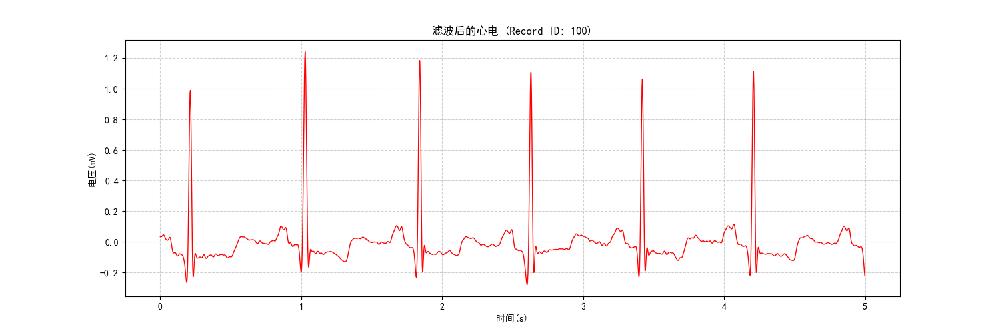
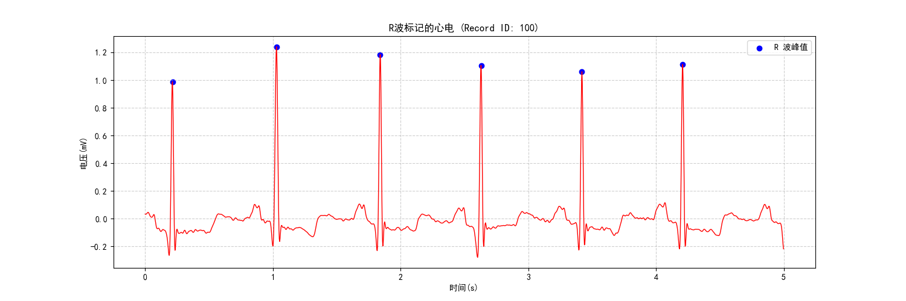

# ECG 信号处理项目 (ECG Signal Processing)

> 一个基于 Python 的心电信号（ECG）处理与分析工具集。
>
> 从 MIT-BIH 心律失常数据库中获取数据，进行信号滤波、R 波检测、心率计算以及异常心律检测。

## 项目结构

```
ECG-signal-processing/
├── data/                  # ECG 数据文件（含 .hea/.dat/.atr，自动下载）
├── examples/              # 示例输出图像
├── dataloader.py          # 数据加载模块（含专家标注读取）
├── filter.py              # 信号滤波模块
├── rwave.py               # R 波检测模块
├── beat.py                # 心率计算模块
├── abnormal.py            # 异常心律检测模块
├── evaluate.py            # 检测性能评估模块
├── draw.py                # 信号可视化模块
├── main.py                # 主程序入口
├── requirements.txt       # 依赖列表
└── README.md
```

## 处理流程

```
原始 ECG 数据 (MIT-BIH)
    ↓
数据加载 (dataloader.py)
    ↓
带通滤波去噪 (filter.py)
    ↓
R 波峰值检测 (rwave.py)
    ↓
专家标注对比评估 (evaluate.py)
    ↓
心率计算与分析 (beat.py)
    ↓
异常心律检测 (abnormal.py)
    ↓
可视化输出 (draw.py)
```

## 功能模块

### 数据加载 (`dataloader.py`)

- 使用 `wfdb` 库载入 MIT-BIH 心律失常数据库中的 ECG 信号
- 自动检测本地数据文件（`.hea`、`.dat`、`.atr`），缺失时从数据库自动下载
- 提供信号 (`signal`)、采样率 (`fs`) 的读取及时间段截取功能
- 支持读取专家搏动标注（`load_annotations`），自动过滤非搏动标注

### 信号滤波 (`filter.py`)

- **带通滤波**：基于 Butterworth 滤波器，去除 0.5Hz 以下的基线漂移和 40Hz 以上的高频噪声
- 使用 `scipy.signal.filtfilt` 实现零相位失真滤波

### R 波检测 (`rwave.py`)

- 应用平方能量增强法突出 R 波特征
- 利用 `scipy.signal.find_peaks` 实现 R 波峰值的自动定位
- 最小峰间距约束为 0.3 秒（对应最大心率 200 BPM）

### 心率分析 (`beat.py`)

- 根据 R 波位置计算 RR 间期（RR Interval）
- 计算瞬时心率（BPM）及全段平均心率
- 异常值过滤（排除 30-200 BPM 范围外的数据）

### 异常心律检测 (`abnormal.py`)

- 检测心动过速（>100 BPM）和心动过缓（<60 BPM）
- 计算心率变异性（HRV，基于 RR 间期标准差 SDNN，单位 ms）
- 综合判定心律状态：正常 / 心律过速 / 心律过缓 / 混合异常

### 检测性能评估 (`evaluate.py`)

> 注意：此模块由Claude Code完成，未经人工Review

- 将算法检测的 R 波与 MIT-BIH 专家标注逐一匹配（容差 150ms，符合 ANSI/AAMI 标准）
- 计算灵敏度 (Se)、阳性预测值 (+P)、F1 分数
- 支持单条记录详细评估和全部 48 条记录批量汇总

### 信号可视化 (`draw.py`)

- 基于 `matplotlib` 绘制 ECG 波形，时间轴以秒为单位
- 支持 R 波标注叠加显示
- 支持中文标题和标签（SimHei 字体）

## 示例输出

- 原始图像


- 滤波后图像



- R 波标点



```
R波检测完成，全段共检测到 X 个点
前5个R波的索引为: [...]
最大瞬时心率: XX.XX bpm
最小瞬时心率: XX.XX bpm
平均心率: XX.XX bpm
异常检测结果: 正常, HRV(SDNN): XX.XX ms

==================================================
  记录 100 - R 波检测性能评估
==================================================
  专家标注搏动数:   2273
  算法检测搏动数:   2273
  正确检测 (TP):    2273
  误检 (FP):        0
  漏检 (FN):        0
  灵敏度 (Se):      1.0000  (100.00%)
  阳性预测值 (+P):  1.0000  (100.00%)
  F1 分数:          1.0000  (100.00%)
==================================================
```

## 环境配置

### 1. 安装依赖

本项目依赖于 `numpy`、`scipy`、`matplotlib` 和 `wfdb`。

```bash
pip install -r requirements.txt
```

### 2. 数据准备

程序默认读取 MIT-BIH 数据库中的 100 号记录。首次运行时，若 `data/` 目录下缺少对应文件（`.hea`、`.dat`、`.atr`），程序会自动从数据库下载。批量评估模式下将自动下载全部 48 条记录。

## 使用方法

```bash
python main.py
```

程序将依次执行：绘制原始信号 → 带通滤波 → R 波检测 → 专家标注评估 → 心率计算 → 异常检测，并在每个阶段输出可视化图表和分析结果。随后对 MIT-BIH 全部 48 条记录进行批量评估，输出汇总性能表。

## 未来优化计划

- 引入 Pan-Tompkins 算法改进版。